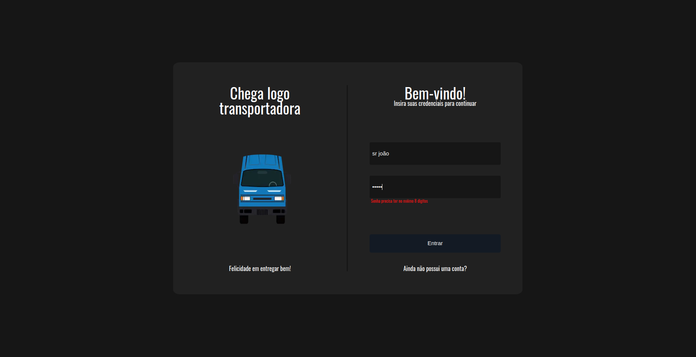
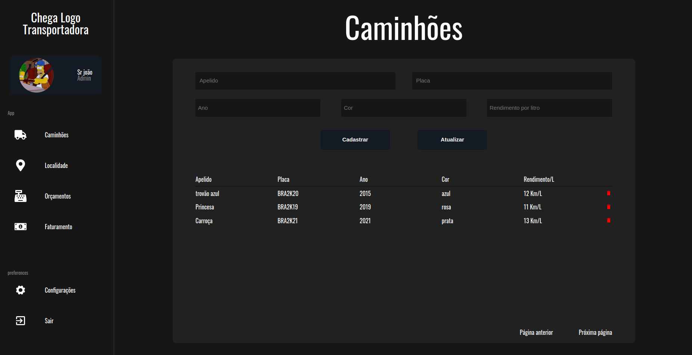
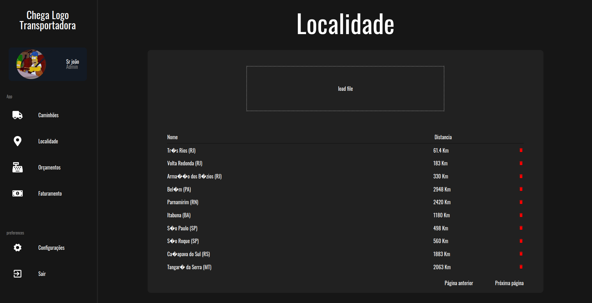
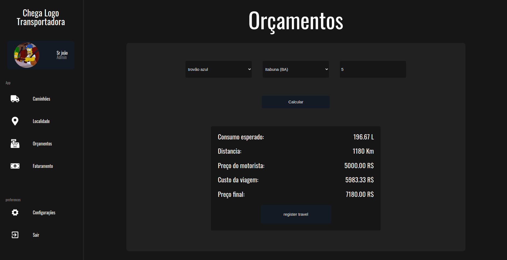
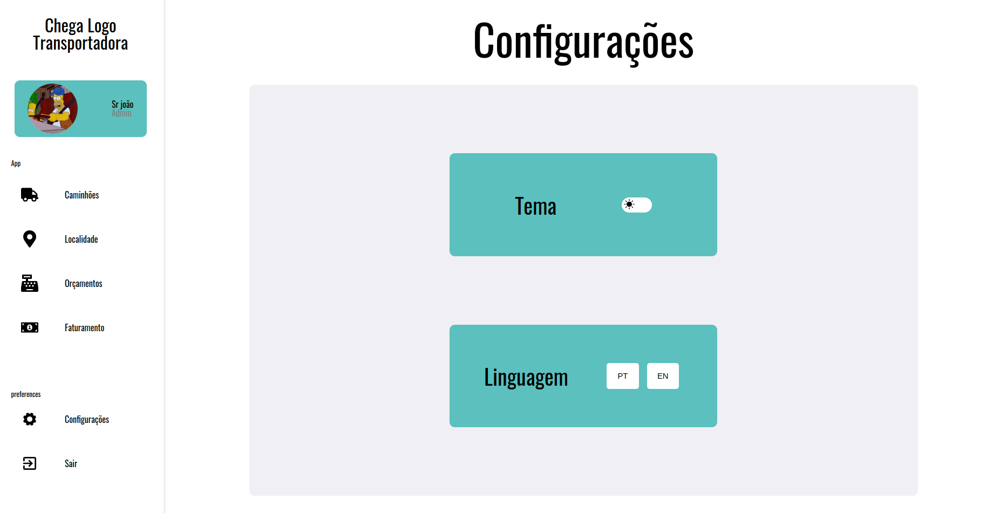
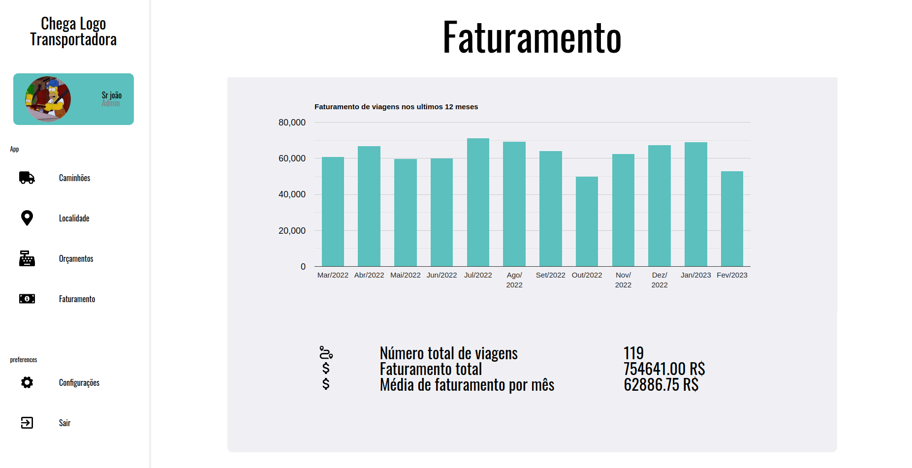
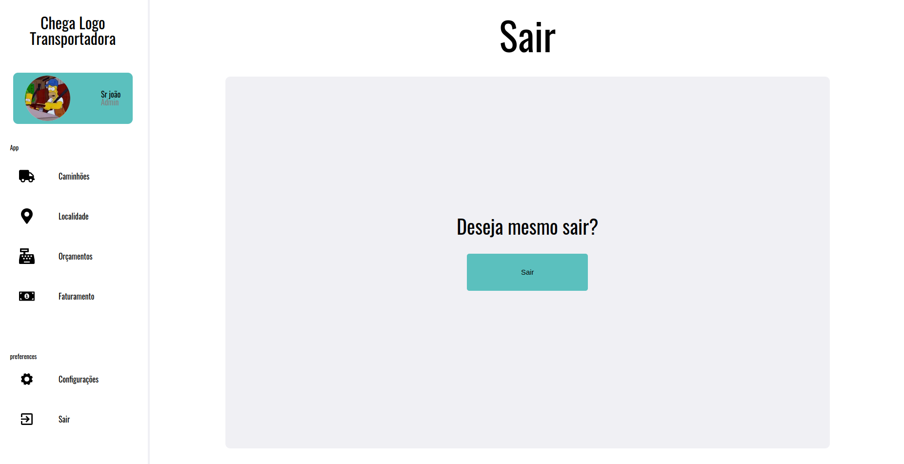

## Description
- Seu João é dono da empresa Chega Logo, uma pequena transportadora. onde fica o galpão dessa empresa, caminhões saem carregando suas entregas para outras localidades, onde deixam o carregamento e retornam. Faz isso com um preço muito competitivo e com excelente pontualidade. O segredo dessa eficiência, segundo Seu João, é o controle que faz das viagens, caminhões e localidades através de uma planilha, cada um em uma respectiva aba. Lá, ele registra tudo o que precisa para calcular o preço das entregas de forma que seja justo mas, também, lucrativo. Contudo, seu João vem enfrentando dificuldades em lidar com a quantidade de dados em sua planilha, que cresce cada vez mais. 
- Esta aplicação é responsavel por organizar todo o esquema de transportes, através de um login de usuário e senha, seu João pode gerenciar tudo de forma dinâmica e segura.
- Para fins de demonstração os dados de faturamento anual já foram previamente inseridos no banco de dados


- [veja meu repositório back end desta aplicação aqui](https://github.com/marcojr73/chega-logo-api)

***
## Running the app

- Install my project, its dependencies and launch backend on port 5000


```bash
  $ git clone https://github.com/marcojr73/chega-logo-front
```

```bash
  ## Local
  $ npm install
  
  $ npm run dev
```
```bash
  ## Run with Docker
  $ npm run docker:build
  
  $ npm run docker:dev
```
***

## Technologies and concepts

- Next
- Typescript
- Context API
- LocalStorage
- Toasts (react-toastify) 
- styled-Componentes
- Themes
- Languages
***
    

## Demo

<p align="center">
   
   
   
   
   
   
   
</p>


## Contact

- Author - [Marco Júnior](https://github.com/marcojr73)
- linkedin - [https://www.linkedin.com/in/marcojr73/](https://www.linkedin.com/in/marcojr73/)
- website - [https://portfolio-marcojr73.vercel.app/](https://portfolio-marcojr73.vercel.app/)

